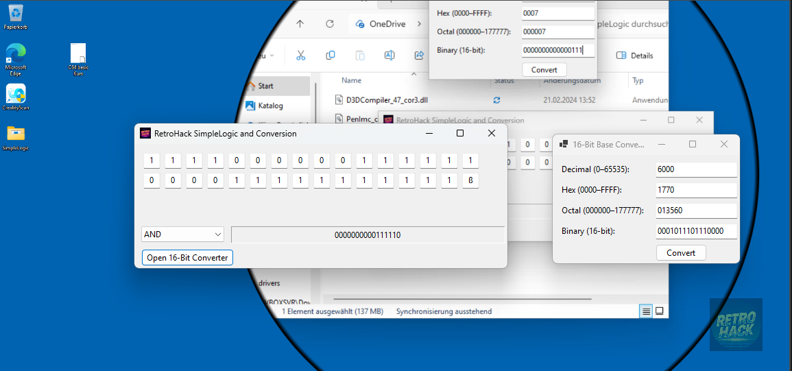

# Simple Logic

A simple **Windows Forms** application to visualize and perform logical operations on 16‑bit patterns and convert between bases. This tool was written with **Commodore 64 enthusiasts** in mind, helping anyone learning 6502 assembly to see bit‑level operations in action.

## Features

- **Two 16‑bit input rows**: Enter your bit patterns, perfectly aligned.
- **Logical operations**: Choose **AND**, **OR**, **XOR**, or **NOT** to apply to your inputs.
- **Live result display**: See the 16‑bit output instantaneously.
- **16‑bit base converter**: Convert between decimal, hexadecimal, octal, and binary.
- **Tab navigation**: Easily move between bit‑boxes and converter fields using the Tab key.

## Why C64 Assembly Learners Will Love It

6502 assembly on the Commodore 64 often requires manual bit‑twiddling—masking, shifting, setting and clearing individual bits. With **BitPatternLogic**, you can:

1. **Visualize** how AND, OR, XOR, and NOT operations affect 16‑bit values.
2. **Convert** between common representations (decimal, hex, octal, binary) to understand how immediate values and masks appear in code.
3. **Experiment interactively** before typing your assembly routines, saving time and reducing bugs.

## Requirements

- **Windows 10+**
- **Visual Studio** (2015 or newer) with **Windows Forms** support
- **.NET Framework 4.7.2** (or higher) or **.NET Core 3.1+**

